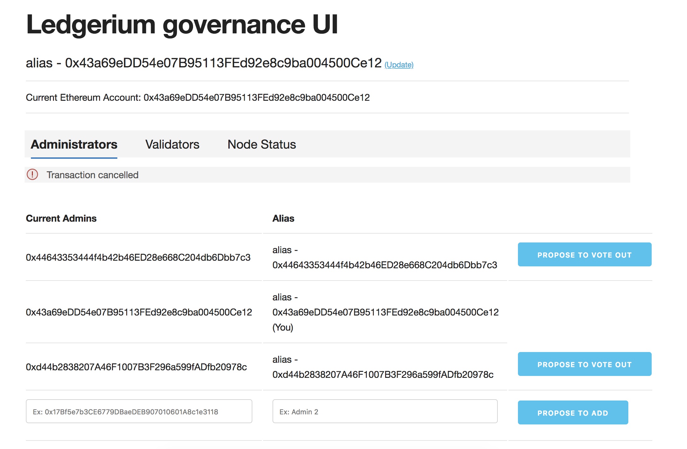
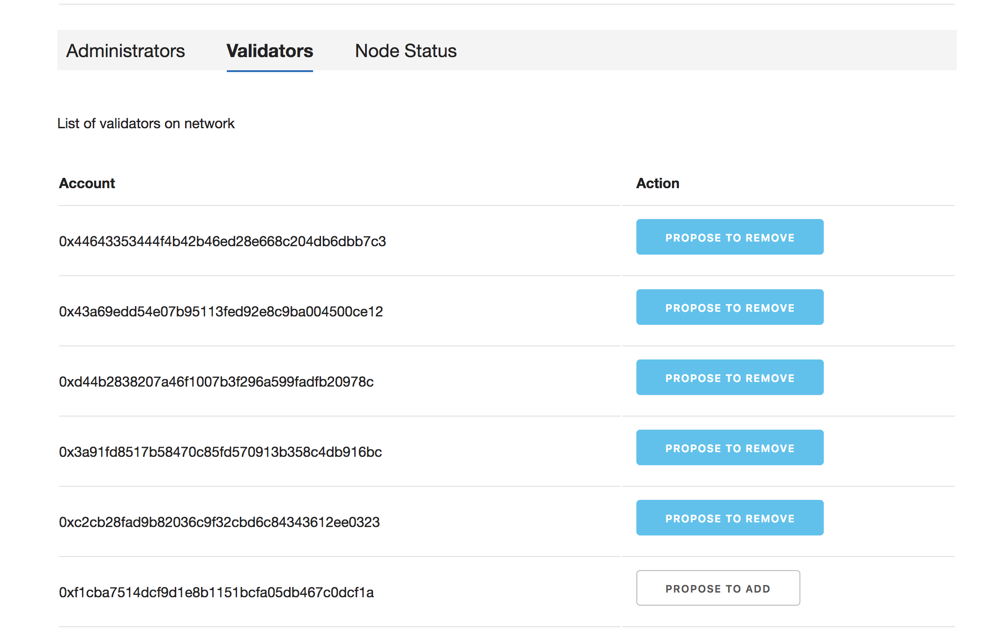

# Governance App
Goveranance App contains smart contracts to manage admin and individual validators to come on platform. 

# How the solution will be used?
  - AdminContractSet - This contract facilitates existing admins to allow new admin to get added to the team by voting with in and also, to vote out to remove it from the team
  - SimpleContractSet - This contract facilitates manage the validators life cycle on the platform, let one of the existing admin add validator or remove validator.

## Tech
It uses the private key of ethereum accounts for writing signed transactions on blockchain so need keystore files in the path

It is designed to work along with yml file which is part of the repo. The IBFT test setup will start 7 validators nodes with each having one coinbase account. One of the coinbase account i.e. @http://localhost:8545 is used to deploy adminValidator (admin solidity contract) and simpleValidator (validator solidity contract)

## Getting Started

### Clone the repo and install the project
- git clone https://github.com/ledgerium/governanceApp.git
- cd governanceApp
- npm install
- node index.js

### We also use truffle for compiling smart contract so truffle can be installed and run compile
- sudo npm install -g truffle
- truffle compile

### Clone the repo and install the project
Create docker network by running this command
- docker network create -d bridge --subnet 172.16.239.0/24 --gateway 172.16.239.1 app_net

Run the geth nodes by running
- docker-compose up -d

This will bring up 
- 7 geth node docker instances
- 7 correspnding constellation node docker instances
- 1 quorum-maker front end app docker instance
- 1 eth-stat front end app docker instance


# governanceUI
The Ledgerium governance app UI

The governance UI is a NodeJS application using handlebars. To run it locally (assuming the dev environment setup is done as per https://github.com/ledgerium/LedgeriumWiki) run this after installing the dependencies. The governanceUI also expects the smart contract is up to date with latest bytecode and contract address.
```
node governanceUI.js
```

The GovernanceUI is served default from port `3002`. Access localhost:3002 from your browser.

All transactions have to be signed by the privatekey managed by the metamask plugin on the browser.

It is also important to note that certain actions will be restricted if the account is not an **admin**, admins or not are determined by the smartcontracts deployed initially. EOAs can be only validators without being an admin, they can participate in the voting/consensus rounds to votein/voteout other validators.



